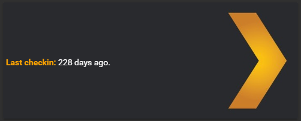

# State Element

This element is **not** all that useful as a card (it can be used for that to), the purpose of this is to give the option to add static text on a `picture-elements` card.

## Options

| Name | Type | Requirement | Description
| ---- | ---- | ------- | -----------
| type | string | **Required** | `custom:state-element`
| entity | string | **Required** | The entity_id of the entity you want to show.
| prefix | string | **Optional** | A string you want to show in front of the attribute, ex. "My prefix string: "
| show_empty | boolean | **Optional** | Give you the possibility to show `unavailable` if the state is empty, default `false`

## Installation

### Step 1

Install `state-element` by copying `state-element.js`from this repo to `<config directory>/www/state-element.js` on your Home Assistant instanse.

**Example:**

```bash
wget https://raw.githubusercontent.com/custom-cards/state-element/master/state-element.js
mv state-element.js /config/www/
```

### Step 2

Link `state-element` inside you `ui-lovelace.yaml`.

```yaml
resources:
  - url: /local/state-element.js?v=0
    type: js
```

### Step 3

Add a custom element in your `ui-lovelace.yaml`

```yaml
      - type: picture-elements
        image: /local/files/LUfuf8ow.jpg
        elements:
          - type: custom:state-element
            entity: sensor.my_sensor
            prefix: "My prefix string: "
```

## Example with styles

```yaml
      - type: picture-elements
        image: /local/files/LUfuf8ow.jpg
        elements:
          - type: custom:state-element
            entity: sensor.untappd_last_checkin
            prefix: "<b style='font-weigth: bold; color: orange'>Last checkin: </b>"
            style:
              top: 47%
              left: 5px
              transform: none
```


